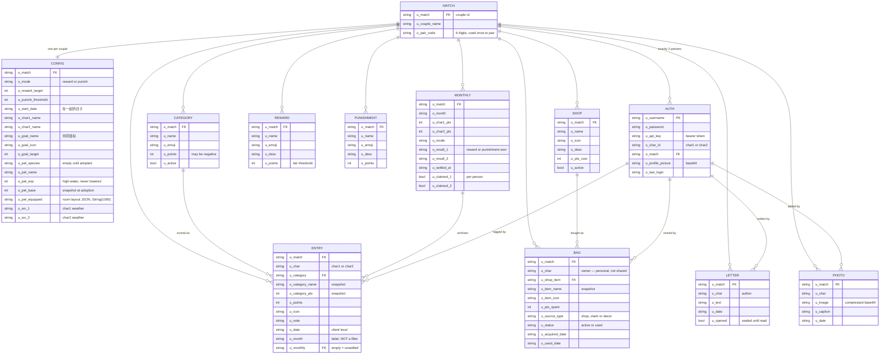

# 恋爱积分簿 · Love Points Tracker 💕

A private score-keeping app for two people. Log the small things you do for each
other — cooking, chores, a letter, a photo — and watch them add up: into points,
into a shared goal, into a pet that grows, into a room you decorate together.

Built as **vanilla JS + HTML + CSS** against a **ServiceNow Scripted REST API**.
No framework, no bundler, no build step. `index.html` is the app.

📖 **[用户使用指南 (User Guide)](USER_GUIDE.md)** · 🐣 **[小窝设计文档](docs/PET_GAME_DESIGN.md)** · 🛠 **[Engineering rules](CLAUDE.md)** · 📋 **[Changelog](docs/CHANGELOG.md)**

---

## What it does

**Scoring**
- Two accounts, one shared ledger. Each partner has their own score; both see every entry.
- Custom categories with emoji and point values; 奖励模式 / 惩罚模式 with a monthly target.
- 月末结算 archives the month to history and starts fresh. Past months are swept
  automatically; the still-running month is opt-in.

**Together**
- **共同目标** — a joint points target you both feed (a trip, a nice dinner).
- **情书** — a private letter arrives as a sealed envelope until your partner opens it.
- **回忆相册** — photos with captions, played back as a Ken Burns slideshow.
- **成就徽章** — 16 badges derived from real activity, so they can never be wrong.
- **年度回顾** — a yearly recap with your best month, top category and that year's photos.
- **对方的天气** — each phone publishes its own weather so you can see their sky.

**恋爱小窝 (the pet game)**
- Adopt one of 4 species; it grows from **your** activity, starting at 0 EXP.
- 小窝币 come from the pet's growth, never from your love points — furniture never
  competes with real rewards.
- **32 hand-drawn SVG pieces**, freely placed, dragged, resized. The room is shared:
  move a sofa and your partner sees it within seconds.
- **10 seasons and festivals** with their own palette, sky, particles and pet outfit.
- **Year-locked keepsakes** — one piece per festival per year (2026–2028 pre-drawn).
  Miss it and it's gone; buy it and it's yours forever.

**The whole app follows your phone**
- 早晨 · 白天 · 黄昏 · 夜晚 — palette and sky follow the local clock; night goes dark.
- The **moon is the real moon**, computed from the lunar cycle — a full disc on 农历十五.
- Real local weather falls over the page and against the pet-room window.

---

## Architecture

```
  iPhone / laptop browser
  ├── index.html   all markup + CSS (4.7k lines)
  └── app.js       all logic — state, render, API, SVG art (6.1k lines)
          │
          │  HTTPS · apikey + Authorization: Bearer <access token>
          ▼
  Supabase  yvllstktmjoedfsgojgs.supabase.co
  ├── /functions/v1/*   27 Edge Functions — every business rule
  ├── Postgres          12 tables, row-level security on all of them
  ├── Auth              hashed passwords, JWT + refresh
  └── Storage           private "photos" bucket, served as signed URLs
```

**Only a function may write.** RLS is `SELECT`-only for clients, so a session token
alone cannot change a row; functions hold the service-role key and bypass RLS. The
upside is that every rule lives in one place. The cost is that there is no second
line of defence behind it — a missing check in a function is simply missing.

No build step: `node --check app.js` is the whole toolchain. The frontend
auto-deploys from `main` via GitHub Pages; functions deploy with
`npx supabase functions deploy <slug>`. Deploy the function first when a change
spans both, or the pushed app calls an endpoint that doesn't answer yet.

> Ran on a free ServiceNow PDI until 2026-09-11. `servicenow/` is kept as history
> — those scripts are the source this was ported from and are no longer deployed.
> See [the changelog](docs/CHANGELOG.md).

---

## Data model

Everything shared is scoped by `u_match` (the couple). Anything personal is also
scoped by `u_char`. Cross-couple reads return empty; cross-couple writes 404.



### Things the diagram can't show

| | |
|---|---|
| **`u_month` is a label, not a filter** | `GET /entries` returns everything with `u_monthly` empty. Filtering by month once made an entire month vanish when it rolled over unsettled. |
| **Furniture lives in `u_love_bag`** | with `u_source_type='decor'`, so no new table was needed. Decor is couple-pooled; shop purchases are personal. |
| **The room is one JSON blob** | `u_pet_equipped` is `String(1000)` and stores 2-letter codes, not ids — ids cost 349 of the 1000 characters and truncation silently wiped rooms. |
| **Weather is one slot per partner** | Two fields, never one shared blob, so simultaneous writes can't lose each other. |
| **Dates come from the client** | The instance runs behind UTC+8, so a server-side date is *yesterday* for most of the users' day. |

---

## API

**Base** `https://yvllstktmjoedfsgojgs.supabase.co/functions/v1`
**Auth** `apikey:` on everything, plus `Authorization: Bearer <access token>` on
everything except register/login. Tokens expire hourly; the client refreshes once
on a 401 and retries.

The table below lists the original ServiceNow resources and the paths `app.js`
still calls. `snFetch` rewrites each onto a function slug — `/entries/:id` becomes
`entries-id?id=…` — which is why no call site changed during the migration.

<details><summary><b>the endpoints</b></summary>

| # | Method | Path | Description |
|---|---|---|---|
| R01 | GET | `/config` | Couple config, names, avatars, pet, goal, weather |
| R02 | PUT | `/config` | Update any of the above |
| R03 | GET | `/categories` | List categories |
| R04 | GET | `/entries` | All **unsettled** entries (`?year=` for the recap) |
| R05 | POST | `/entries` | Add an entry |
| R06 | PUT | `/entries/:id` | Edit |
| R07 | DELETE | `/entries/:id` | Delete |
| R08 | GET | `/rewards` | Reward tiers |
| R09 | GET | `/punishments` | Punishment tiers |
| R10 | GET | `/history` | Settled months |
| R11 | POST | `/monthly/settle` | Settle one month |
| R12–14 | POST/PUT/DELETE | `/categories[/:id]` | Category CRUD |
| R15–17 | POST/PUT/DELETE | `/rewards[/:id]` | Reward CRUD |
| R18–20 | POST/PUT/DELETE | `/punishments[/:id]` | Punishment CRUD |
| R21 | POST | `/auth/register` | Register, or pair with a code |
| R22 | POST | `/auth/login` | Login → apiKey + partner name |
| R23 | PUT | `/auth/charimg` | Upload avatar |
| R24–27 | GET/POST/PUT/DELETE | `/shop[/:id]` | Shop CRUD |
| R28 | POST | `/shop/buy/:id` | Redeem points |
| R29 | GET | `/bag` | Owned items (`?type=decor` for furniture) |
| R30 | POST | `/bag/use/:id` | Mark used |
| R31 | GET | `/bag/history` | Used items |
| R32 | POST | `/bag/claim` | Claim a milestone reward |
| R33–36 | GET/POST/PUT/DELETE | `/letters[/:id]` | Letters |
| R37–39 | GET/POST/DELETE | `/photos[/:id]` | Memory photos |
| R40 | POST | `/decor/buy` | Buy furniture with 小窝币 (never touches love points) |

</details>

---

## Running it

```bash
git clone https://github.com/YapSeng98/Love-Points-Tracker.git
cd Love-Points-Tracker
python3 -m http.server 8000      # or just open index.html
```

Live at **[yapseng98.github.io/Love-Points-Tracker](https://yapseng98.github.io/Love-Points-Tracker/)** — pushes to `main` deploy automatically.

**Pairing:** partner 1 registers as 他💙 and gets a 6-digit code; partner 2 registers
as 她🩷 with that code. **Local Demo** on the login screen runs the whole app against
`localStorage` with no account — everything except the shop and bag.

---

## Tests

| Suite | What it covers |
|---|---|
| `node supabase/test-full.mjs` | **91 live checks** against the real backend — auth + pairing, scoring, settle, shop, buy, bag, claims, decor, letters, photos, avatars, couple isolation, unauthenticated refusal |
| `node supabase/test-api.mjs` | **47 checks** — a narrower slice, plus direct-to-Postgres bypass attempts |
| `node supabase/cleanup-test-accounts.mjs` | Removes the throwaway couples the suites leave behind. Dry-run by default |
| `servicenow/test-*.sh` | **Historical** — tests the ServiceNow backend, which nothing uses |
| Browser suites (scratchpad) | **~545 checks** across 42 files — pet logic, coin economy, seasons, moon phase, weather, layout at 3 widths, contrast from rendered pixels, performance, full user journey |
| `regression_reported.js` | **Every bug ever reported**, replayed. A red line here means it's back. |
| `tools/season-check.js` | Runs monthly in CI: fails if the lunar table or the pre-drawn keepsake years are running out |

Two habits worth knowing, both learned the hard way and written up in [CLAUDE.md](CLAUDE.md):

- **Assert behaviour, not storage.** A batch of tests broke when the room blob was
  compacted — they were checking the format, not the outcome.
- **A green test is not proof.** The moon shipped rendered *inverted* with its test
  passing, because the test asserted the implementation's own convention. Three of
  the 21 hand-drawn furniture pieces had to be redrawn for looking wrong, and every
  test passed on all three. Some things you have to look at.

---

## Notes for future changes

- **Emoji encoding** — a ServiceNow-era workaround: its DB was `utf8mb3`, so 4-byte emoji (🎯) corrupted. Postgres stores them fine, but the encode/decode pair stays so rows written before the migration still read back correctly.
  Text fields go through `encodeForSN()` / `decodeFromSN()` as `\xCODEPOINT`.
- **No scheduled jobs anywhere** — themes, seasons, the moon and shop stock are all
  computed from the device clock. The only cron is a monthly CI content check.
- **Bump `APP_VERSION` and `HTML_V` together** — `HTML_V` must equal the
  `app-html-v` meta tag, or phones run new JS against cached HTML.
- **Read [CLAUDE.md](CLAUDE.md) before changing anything.** Every rule in it exists
  because something broke in production first.
